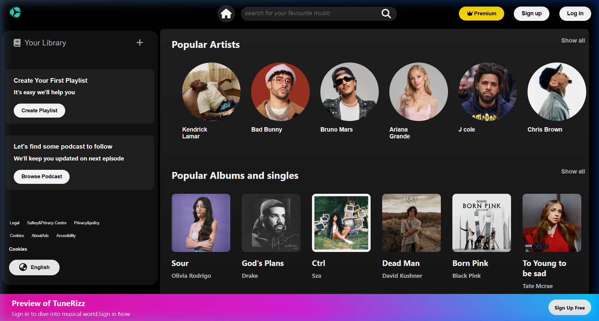
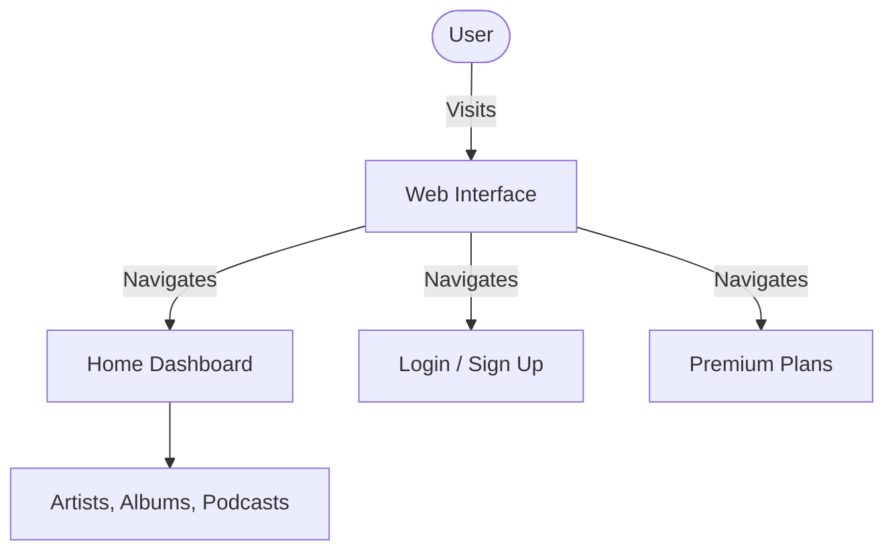

<h1 align="center">TuneRizz 🎵</h1>

<p align="center">A highly polished, responsive music streaming interface designed for a premium user experience.</p>

<p align="center">
  
  
  
</p>

---

## 🎬 Demo


## ✨ Key Features

| Feature | Description |
|--------|-------------|
| 🎧 **Expansive Library** | Browse popular artists, albums, popstars, and Indian hits. |
| 👑 **Premium Access** | Integrated premium subscription pages and login portals. |
| 🎨 **Modern UI** | Sleek, dark-mode design inspired by top music streaming platforms. |
| 📱 **Responsive Layout** | Optimized CSS structure for seamless navigation. |

## 📸 Screenshots

### Home Dashboard


## 🛠️ Tech Stack

**Frontend:**
- **HTML5** (Semantic Structure)
- **CSS3** (Flexbox, Grid, Custom Properties)
- **FontAwesome** (Icons)

## 🧩 Architecture

The application is structured as a multi-page static site, prioritizing fast load times and clean component separation:



## 🚀 Installation & Usage

1. **Clone the repository**
   ```bash
   git clone https://github.com/PRIY4DH4RS4N-D/tunerizz.git
   cd tunerizz
   ```

2. **Run locally**
   - Open `index.html` directly in any modern web browser.
   - Alternatively, use Live Server in VS Code for a better development experience.

## 💡 Why I Built This

This project was built to master modern CSS layout techniques (Flexbox and Grid) and to create a pixel-perfect, scalable web interface that mimics the complexity of real-world music streaming platforms.

## 🧠 Engineering Challenges

- **Complex Layouts:** Structuring multiple nested sections (navbar, sidebar, main content area, player preview) required careful application of CSS Flexbox.
- **Asset Management:** Organizing and linking numerous high-quality images effectively while maintaining a smooth scrolling experience.
- **Consistent Theming:** Ensuring dark mode elements remained cohesive across various components without relying on CSS frameworks.

## 📚 What I Learned

- Advanced CSS selectors and robust styling practices.
- Effective project structuring for static web applications.
- Integrating external icon libraries seamlessly.

## 🗺️ Roadmap

- [x] Core HTML/CSS Layout
- [x] Multi-page navigation (Login, Signup, Premium)
- [ ] Add JavaScript for a functional music player preview
- [ ] Implement responsive breakpoints for mobile devices
- [ ] Add dynamic data fetching from a music API

## 🧑‍💻 Author

**Priyadharsan D**
- GitHub: [@PRIY4DH4RS4N-D](https://github.com/PRIY4DH4RS4N-D)

## 📄 License

This project is licensed under the MIT License - see the [LICENSE](LICENSE) file for details.
